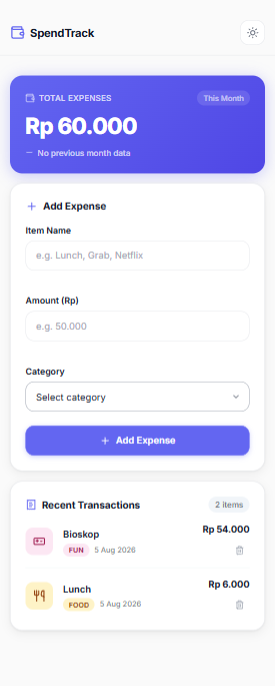
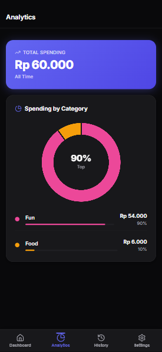
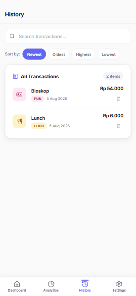
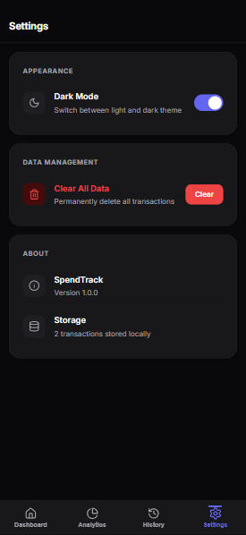

# 💸 Spendly — Expense & Budget Visualizer

A modern, responsive, and mobile-first expense tracking web application built with **HTML**, **CSS**, and **Vanilla JavaScript**.

Spendly helps users record daily expenses, monitor spending habits, and visualize financial data through an intuitive dashboard with interactive charts. All data is stored locally using the browser's **Local Storage API**, making the application lightweight and easy to use without a backend.

---

## 📸 Preview

<table align="center">
  <tr>
    <td align="center" valign="top">
      <b>Dashboard</b><br>
      
    </td>

    <td align="center" valign="top">
      <b>Analytics</b><br>
      
    </td>
  </tr>

  <tr>
    <td align="center" valign="top">
      <b>History</b><br>
      
    </td>

    <td align="center" valign="top">
      <b>Settings</b><br>
      
    </td>
  </tr>
</table>

---

## ✨ Features

### 📊 Dashboard

- View total expenses
- Monthly spending summary
- Recent transactions
- Quick expense input

### ➕ Expense Management

- Add new expenses
- Delete transactions
- Form validation
- Automatic balance updates

### 📈 Analytics

- Interactive Doughnut Chart using Chart.js
- Expense breakdown by category
- Real-time chart updates

### 📜 Transaction History

- View all transactions
- Search transactions
- Sort transactions

### ⚙️ Settings

- Dark / Light Mode
- Clear all data
- Local Storage persistence

---

## 🚀 Tech Stack

- HTML5
- CSS3
- Vanilla JavaScript (ES6)
- Chart.js
- Lucide Icons
- Local Storage API

---

## 📂 Project Structure

```text
.
├── assets
│   ├── icons
│   └── images
│       ├── desktop-preview.png
│       ├── mobile-preview.png
│       └── dark-preview.png
│
├── index.html
├── styles.css
├── app.js
└── README.md
```

---

## 🎯 Expense Categories

- 🍔 Food
- 🚗 Transport
- 🎮 Entertainment

---

## 💾 Data Storage

All application data is stored locally using the browser's **Local Storage API**.

No backend server or database is required.

---

## 📱 Responsive Design

Spendly follows a **mobile-first** design approach and is fully responsive across different devices.

Supported devices:

- 📱 Mobile
- 💻 Tablet
- 🖥 Desktop

---

## 🌙 Additional Features

- ✅ Dark / Light Mode
- ✅ Monthly Expense Summary
- ✅ Transaction Search
- ✅ Transaction Sorting
- ✅ Persistent Local Storage

---

## 🛠 Installation

Clone this repository:

```bash
git clone https://github.com/Laszz/CodingCamp-3August26-alifnaufalnirwasita.git
```

Navigate to the project directory:

```bash
cd CodingCamp-3August26-alifnaufalnirwasita
```

Run the application by opening:

```text
index.html
```

Or use **Live Server** in Visual Studio Code.

---

## 🌐 Live Demo

**GitHub Pages**

https://laszz.github.io/CodingCamp-3August26-alifnaufalnirwasita/

---

## 📚 Learning Objectives

This project demonstrates the implementation of:

- Semantic HTML5
- Responsive CSS3
- Mobile-first Design
- Vanilla JavaScript (ES6)
- DOM Manipulation
- Event Handling
- Local Storage API
- Data Visualization using Chart.js
- Clean User Interface Design

---

## 📄 License

This project was created for educational purposes as part of the **CodingCamp Software Engineering Program**.

---

## 👨‍💻 Author

**Alif Naufal Nirwasita**

- GitHub: https://github.com/Laszz

---

Made for CodingCamp 2026